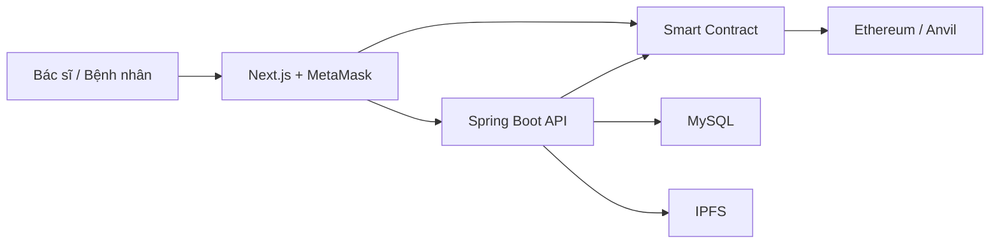

# Kiến trúc hệ thống

## Luồng tạo bệnh án

1. Bác sĩ nhập dữ liệu trên frontend.
2. Backend xác thực JWT, mã hóa file và tải lên IPFS.
3. IPFS trả về CID.
4. Giao dịch đã ký ghi CID và metadata tối thiểu lên smart contract.
5. Backend lưu tham chiếu và audit log trong MySQL.

## Lưu trữ IPFS an toàn

- `StorageService` tách domain khỏi Kubo và Pinata.
- Backend kiểm tra kích thước và allowlist MIME trước khi xử lý.
- File được mã hóa AES-256-GCM trước khi rời backend.
- Khóa mã hóa chỉ lấy từ biến môi trường; database không lưu khóa.
- CID, metadata, IV và content hash được lưu trong MySQL.
- API tải xuống kiểm tra ownership từ JWT, giải mã và xác minh hash.
- CID và IV không được trả trong API metadata.

## Luồng cấp quyền

1. Bệnh nhân kết nối MetaMask.
2. Bệnh nhân gọi smart contract để cấp hoặc hủy quyền cho địa chỉ bác sĩ.
3. Backend kiểm tra cả quyền ứng dụng và quyền on-chain trước khi trả dữ liệu.

