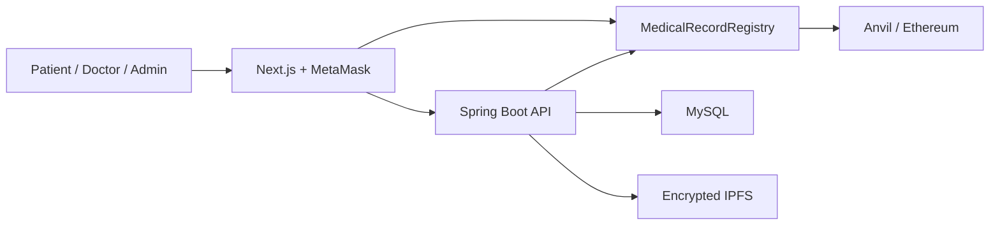

# Kiến trúc hệ thống

## Phân vùng dữ liệu

- MySQL: account, profile, facility, access request, synchronized grant, record metadata và audit log.
- IPFS: ciphertext của file bệnh án.
- Blockchain: facility whitelist, facility consent, CID/hash/source/uploader/timestamp.

## Quyền truy cập

Patient cấp quyền cho `facilityId`, không cấp trực tiếp cho doctor wallet. Doctor
phải được admin verify và thuộc facility active. Backend kiểm tra cả SQL synchronized
grant và trạng thái blockchain trước khi đọc hoặc upload hồ sơ.

## Upload

Backend mã hóa và upload IPFS trước. Frontend ký transaction metadata bằng ví của
patient hoặc doctor. Backend chỉ xác nhận record sau khi đối chiếu dữ liệu on-chain.
