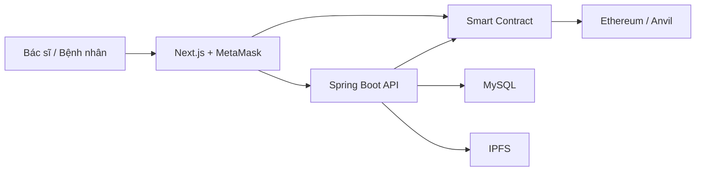

# Kiến trúc hệ thống

## Luồng tạo bệnh án

1. Bác sĩ nhập dữ liệu trên frontend.
2. Backend xác thực JWT, mã hóa file và tải lên IPFS.
3. IPFS trả về CID.
4. Giao dịch đã ký ghi CID và metadata tối thiểu lên smart contract.
5. Backend lưu tham chiếu và audit log trong MySQL.

## Luồng cấp quyền

1. Bệnh nhân kết nối MetaMask.
2. Bệnh nhân gọi smart contract để cấp hoặc hủy quyền cho địa chỉ bác sĩ.
3. Backend kiểm tra cả quyền ứng dụng và quyền on-chain trước khi trả dữ liệu.

